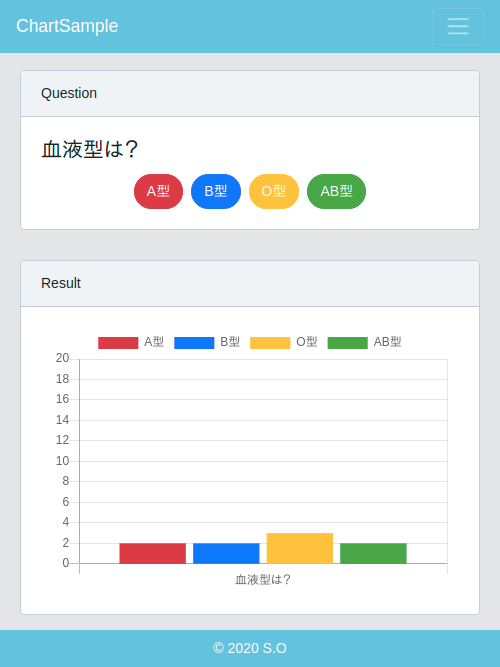
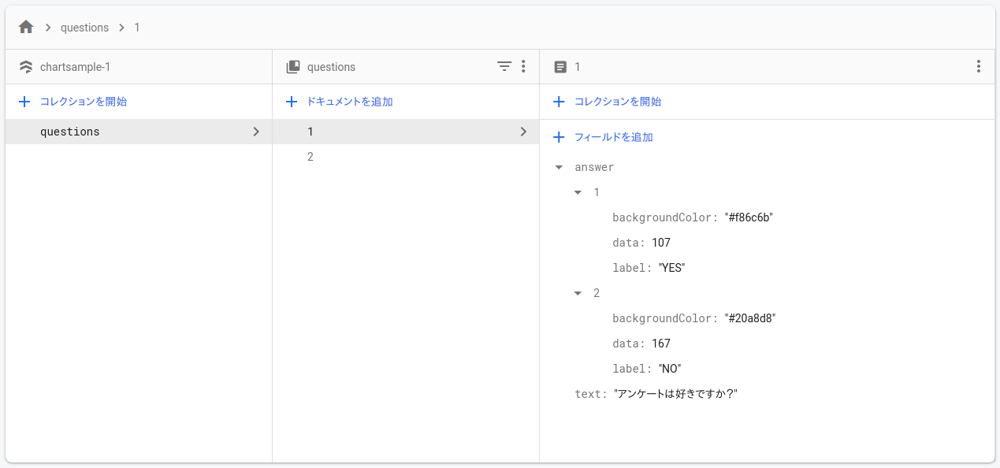

# Nuxt.js typescript chart sample

## Description
Nuxt.js TypeScript vue-chartjs project with firebase.</br>
(simple vote application)</br>


## Requirement
* yarn
* firebase-tools

## firestore
Make collenction/document/fields on firestore.


## Put ".env"
Write your firebase project variables to ".env".(This variables are used by plugins/firebase.ts)
```bash
FB_API_KEY="XXXXXXXXXXXXXXXXXXXXXXXXXXXXXXXXXXXXXXX"
FB_AUTH_DOMAIN="XXXXXXXXXX"
FB_DATABASE_URL="XXXXXXXXXX"
FB_PROJECTID="XXXXXXXXXX"
FB_STORAGE_BUCKET="XXXXXXXXXX"
FB_MESSAGING_SENDER_ID="XXXXXXXXXXXX"
```

## Generate Setup
``` bash
# install dependencies
$ yarn install

# serve with hot reload at localhost:3000
$ yarn run dev

# generate static project
$ yarn run generate
```

## Deploy to Firebase
```bash
# setup project
$ firebase init

# deploy
$ firebase deploy
```
